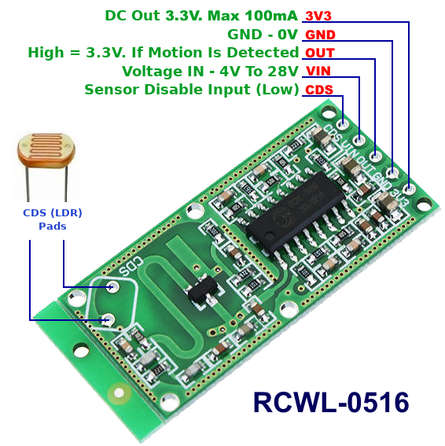

Python3 scripts for RCWL-0516 motion detector on Beaglebone Black

NOTE:
-----
this sensor will detect any type of movement, it uses microwave
radar and does not use inferred to detect movement if you wish to
detect only inferred use the HC-SR501 sensor.

| Board pin name | Board pin | Beaglebone Black pin name |
|----------------|-----------| --------------------------|
| GND            | 1         | P9\_1, Ground             |
| OUT            | 2         | P9\_12, GPIO              |
| VCC            | 3         | P9\_05, VDD\_5v           |
| CDS            | 4         | P9\_30, GPIO              |

